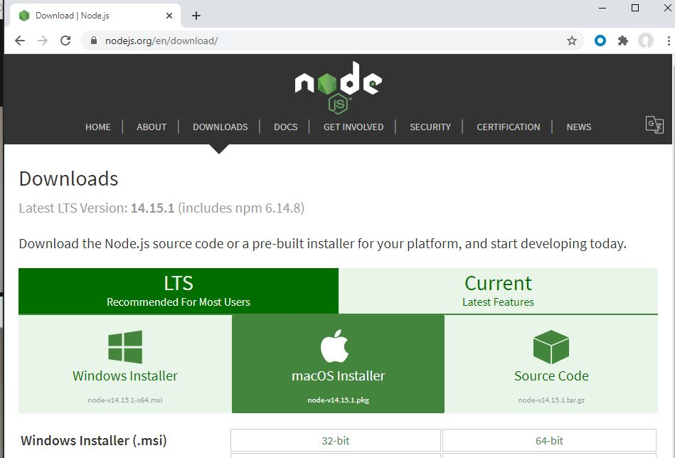

# Installfest

- [x] [Github and Initial Setup](github.md)
- [x] [Git](git.md)
- [x] [Bash Configuration](bash.md)
- [x] [Command Line Tools - Xcode (macOS only)](command_line_tools.md)
- [x] [Homebrew](homebrew.md)
- [ ] **Node**
- [ ] [Python](python.md)
- [ ] [Chrome](chrome.md)
- [ ] [VS Code](vscode.md)

## Node

We're going to be installing Node. Node (and its various packages) will be
the foundation of a large part of the course.


#### Graphic Install



After you complete the install, verify with this:

```bash
which node
node --version
```


**Restart your terminal and navigate back to the installfest directory.**

### NPM Packages
Now, we will use Node's associated package manager, `npm`, to download and install some Node
modules and make them available across all of our projects.

```bash
scripts/npm.sh
```

[Continue With Installfest](python.md)
